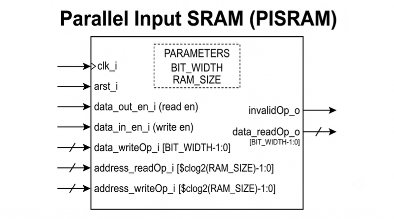

# Project SRAM
SRAM stands for **Static Random Access Memory**, it is an semiconductor memory which by design offers native silicon speeds.

SRAM is used in almost all applications in the modren world. And is core component where an Processor is needed.

SRAM is choosed over DRAM (its counterpart, Dynamic RAM) where performance is critical (compramising on power and area) than area and cost.

# Milestones
- [x] Parallel Interface SRAM [PISRAM](Design_src/PISRAM.sv)
- [ ] Minimal Interface SRAM [MISRAM](Design_src/MISRAM.sv)

# Docs

## Parallel Interface SRAM
Block diagram of PISRAM interface.

## Minimal Interface SRAM